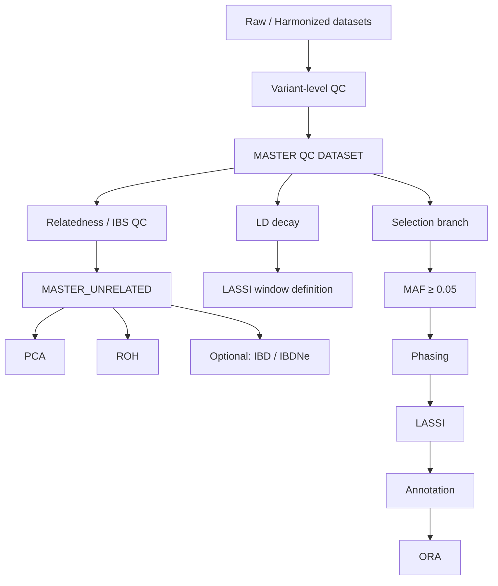

# Pipeline diagram

Description

The pipeline is structured around a central quality-controlled dataset, from which multiple analysis branches originate.

After variant-level quality control, a master dataset is generated and further filtered for relatedness to obtain a set of unrelated individuals. This dataset is used for population structure analyses, including PCA and ROH.

In parallel, the QC-filtered dataset is used for selection analyses. Linkage disequilibrium (LD) decay is estimated to define the genomic window size used in LASSI. The target dataset is then phased and analyzed using a likelihood-based framework to identify candidate regions under selection.

An optional branch based on IBD segment detection and IBDNe can be used to infer recent demographic history.
