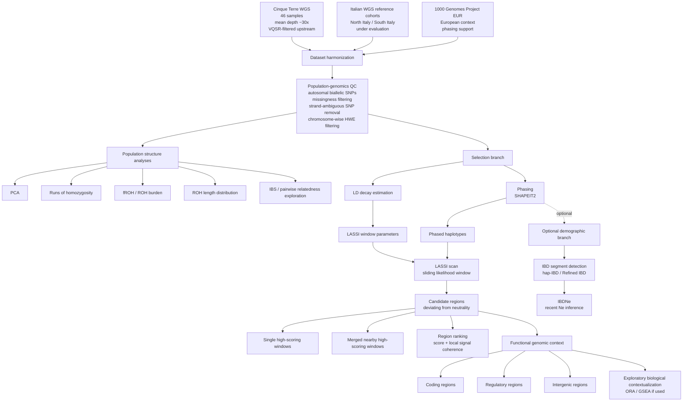

# Pipeline diagram

## Workflow overview

This document provides a schematic representation of the Cinque Terre population genomics and selection workflow.

The pipeline is organized around four main components:

* input datasets
* harmonization and QC
* population structure analyses
* selection scan and candidate region interpretation

An optional demographic branch may be added if data suitability and analytical priorities support it.

---

## Conceptual workflow



---

## Input datasets

The workflow starts from three dataset categories.

### Cinque Terre target dataset

The target dataset consists of:

* 46 WGS samples
* mean depth approximately 30x
* variants already called upstream
* variants already VQSR-filtered upstream

Variant calling and VQSR are not repeated within this workflow.

### Italian WGS reference cohorts

The main comparative framework is expected to involve Italian WGS cohorts representing:

* North Italy
* South Italy

These cohorts are currently under evaluation and may be based on Sazzini et al. (2020), depending on data availability and suitability.

### 1000 Genomes Project EUR

The 1000 Genomes Project EUR panel is used as:

* European genetic context
* phasing support
* possible comparison with selected European populations

Candidate 1000 Genomes EUR populations for selection-related comparison currently include:

* TSI
* FIN
* IBS

The final comparison set remains under evaluation.

---

## Harmonization and QC

All datasets are harmonized before downstream analyses.

The harmonization and QC strategy includes:

* GRCh37.p13 / hg19 coordinates
* VCF 1-based coordinates
* chromosomes 1-22 only
* autosomal SNPs only
* removal of multiallelic variants
* removal of monomorphic SNPs
* removal of strand-ambiguous SNPs (A/T and C/G)
* removal of variants with more than 5% missing genotypes
* removal of individuals with more than 5% missing genotypes
* chromosome-wise HWE filtering using Bonferroni correction

The HWE threshold is computed separately for each chromosome as:

```text
0.05 / number of tested variants on that chromosome
```

---

## Population structure analyses

Population structure analyses are used to describe the genetic placement, relatedness, and autozygosity of the Cinque Terre population within an Italian and European context.

The main analyses are:

* PCA
* runs of homozygosity
* fROH
* total ROH burden
* ROH length distribution
* IBS / pairwise relatedness exploration

The following analyses are not part of the current workflow unless explicitly added later:

* ADMIXTURE
* FST
* ancestry proportion inference
* formal population grouping inference

---

## Selection branch

The selection branch is focused on the Cinque Terre population.

The main method is:

* LASSI

The selection workflow includes:

* MAF filtering
* LD decay estimation
* phasing with SHAPEIT2
* LASSI scan using a sliding likelihood window
* candidate region definition
* candidate region ranking
* functional genomic annotation

LD decay and phasing are both preparatory steps for the LASSI branch.

Phasing is not considered a downstream consequence of LD decay.

LD decay is used to define LASSI window-size parameters, while phasing provides the haplotypes required for the LASSI scan.

---

## Candidate regions

The main output of the selection branch is a set of candidate genomic regions deviating from neutral expectations.

Candidate regions may consist of:

* single high-scoring windows
* multiple nearby high-scoring windows merged into a broader candidate region

Candidate region definition and ranking consider:

* maximum LASSI score
* mean LASSI score
* local signal coherence
* maximum distance in kb allowed between neighboring windows
* genomic span
* functional genomic context

Candidate regions are not interpreted as definitive proof of adaptation or causal variants.

---

## Functional interpretation

Functional interpretation is treated as exploratory biological contextualization.

Candidate regions may be annotated according to:

* coding regions
* regulatory regions
* intergenic regions

ORA and/or GSEA-like approaches may be used if appropriate.

These analyses are used for interpretation and hypothesis generation, not as independent validation of selection.

---

## Optional demographic branch

An optional demographic branch may be performed if data suitability and analytical priorities support it.

The potential workflow includes:

* phased haplotypes
* IBD segment detection using hap-IBD or Refined IBD
* IBDNe for recent effective population size inference

IBDNe estimates may be converted from generations into calendar years using a generation time of 29 years.

This branch remains optional and is not required for the main population structure and selection analyses.
