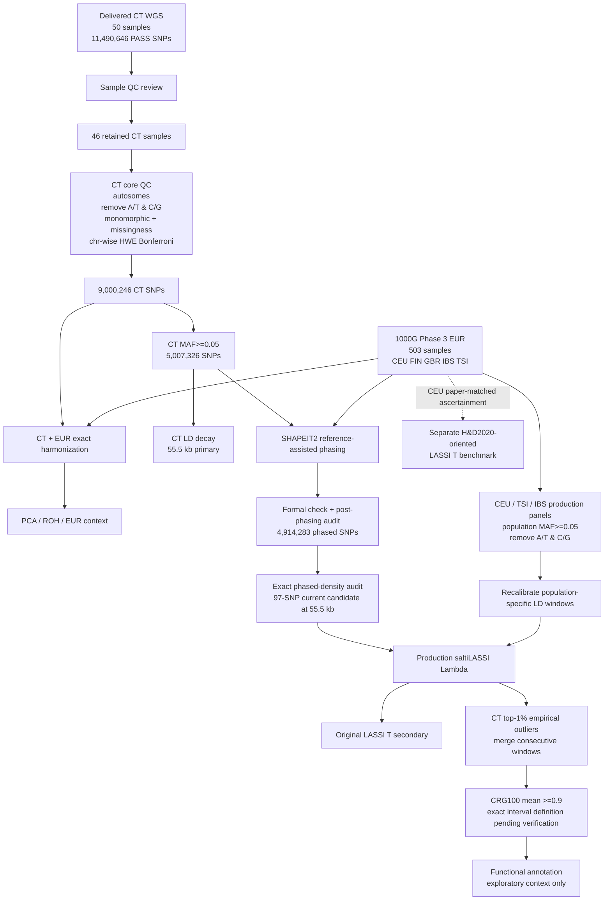

# Pipeline diagram

## Current workflow

## Interpretation

The delivered CT dataset is not re-called or re-VQSR-filtered. The workflow begins from the upstream PASS biallelic-SNP VCF and applies population-genomic QC.

The 1000 Genomes EUR panel has different roles in different branches: joint European context, SHAPEIT2 reference support, and population-specific CEU/TSI/IBS selection comparators.

Production selection comparison requires matched marker-policy logic across CT/CEU/TSI/IBS. The separate CEU Harris & DeGiorgio benchmark is intentionally not forced to share the production ascertainment because its purpose is methodological continuity with the published original-LASSI empirical analysis.

Italian WGS cohorts remain a possible future extension and are not a dependency of the current production selection branch.
